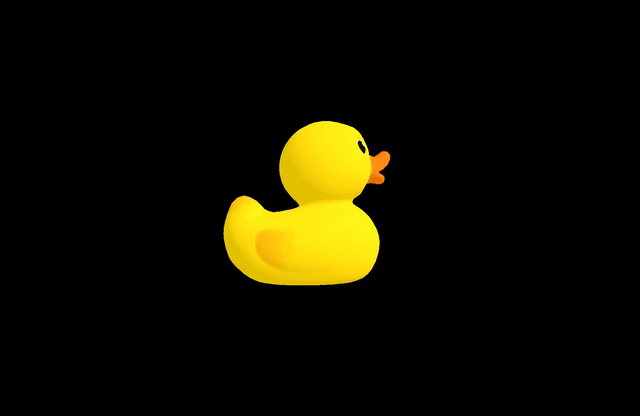
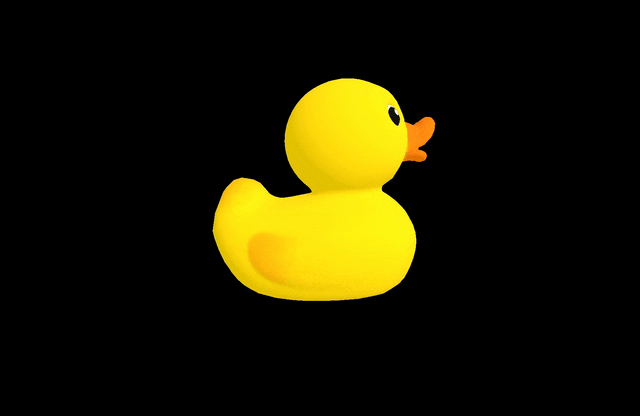

### 3D モデルホバー時に大きさを変える

- 3D モデルにマウスポインターがホバーしたらモデルを大きくスケーリングしたい

    #### ポイント

    - Raycaster.intersect系メソッドのに渡すオブジェクトは Object3D 型

        - [GLTF オブジェクトの scene プロパティ](https://github.com/MasaGt/threejs_journey/blob/21ec4d5e81594f8924e8f669bcc15a61835c26c9/chap3/21/3d%E3%83%A2%E3%83%87%E3%83%AB%E3%81%AE%E5%8F%96%E3%82%8A%E8%BE%BC%E3%81%BF.md#%E3%83%AD%E3%83%BC%E3%83%89%E3%81%97%E3%81%9F-gltf-%E3%83%A2%E3%83%87%E3%83%AB%E3%81%AE%E6%83%85%E5%A0%B1%E3%81%AE%E4%B8%AD%E8%BA%AB) は[Goup 型](https://threejs.org/docs/?q=Group#api/en/objects/Group)

        - Group 型は Object3D を継承しているので、Raycaster.intersect系のメソッドに Group 型オブジェクトも渡すことができる

    <br>

    ```js
    /*
    * 3D モデルの取り込み
    */
    const dracoLoader = new DRACOLoader();
    dracoLoader.setDecoderPath("/draco/");

    const gltfLoader = new GLTFLoader();
    gltfLoader.setDRACOLoader(dracoLoader);

    //★★3Dモデルを参照する変数 (後に3Dモデルを操作するために必要)
    let model = null;
    gltfLoader.load(
        "/models/Duck/glTF-Draco/Duck.gltf",
        (gltf) => {
            model = gltf.scene;
            scene.add(model);
        }
    );

    /**
     * mouse event
    */
    let pointer = new THREE.Vector2();

    window.addEventListener("mousemove", (e) => {
        let x = ((e.clientX / window.innerWidth) * 2) - 1;
        let y = - (e.clientY / window.innerHeight * 2 - 1);

        pointer.set(x, y);
    });

    /**
    * Raycaster
    */
    const raycaster = new THREE.Raycaster();

    /**
    * アニメーション関数
    */
    const tick = () =>
    {
        const elapsedTime = clock.getElapsedTime()

        //cast a ray
        raycaster.setFromCamera(pointer, camera);

        //★★★マウスポインターが3Dモデルにホバーしたら、大きくスケールする
        if (model) {
            model.scale.set(1,1,1);
            const hitObject = raycaster.intersectObject(model);
            if (hitObject.length) {
                model.scale.set(2, 2, 2);
            }
        }

        // Render
        renderer.render(scene, camera)

        // Call tick again on the next frame
        window.requestAnimationFrame(tick)
    }

    tick()
    ```

<br>



---

### 3D モデルクリック時に色を変える

- 3D モデルをクリックしたらモデルの色を変更したい

    #### ポイント

    - GLTF オブジェクトの scene プロパティは Group 型のオブジェクト

        - Group 型オブジェクトは rotation, translate, scale などの操作は行えるが、マテリアルのカラーの変更はできない

        - よって、Group 型オブジェクトの子オブジェクトを for ループで Mesh かどうかを調べ、 Mesh であればその Material.color を変更するように処理を記述する

    <br>

    ```js
    /*
    * 3D モデルの取り込み
    */
    const dracoLoader = new DRACOLoader();
    dracoLoader.setDecoderPath("/draco/");

    const gltfLoader = new GLTFLoader();
    gltfLoader.setDRACOLoader(dracoLoader);

    //★★3Dモデルを参照する変数 (後に3Dモデルを操作するために必要)
    let model = null;
    gltfLoader.load(
        "/models/Duck/glTF-Draco/Duck.gltf",
        (gltf) => {
            model = gltf.scene;
            scene.add(model);
        }
    );

    /**
    * Raycaster
    */
    const raycaster = new THREE.Raycaster();

    /**
    * Click時の処理
    */
    //★★Rayと交差したオブジェクトを保持する変数
    let hitObject = [];
    window.addEventListener('click', (e) => {
        if (hitObject.length > 0) {

            //★★ここの処理に関しては、gltf.sceneがどのような構造になっているかをログに出力してから記述する
            const children = [...model.children[0].children]

            //3Dモデル = Group型オブジェクトの子オブジェクトをループで走査
            for (const child of children) {

                //子オブジェクトがMeshの場合、そのマテリアルの色を赤に変更
                 if (child.isMesh) {
                     model.material.color.set("#ff0000");
                 }
             }
        }c
    });

    /**
    * アニメーション関数
    */
    const tick = () =>
    {
        const elapsedTime = clock.getElapsedTime()

        //cast a ray
        raycaster.setFromCamera(pointer, camera);
        if (model !== null) {
        hitObject = raycaster.intersectObject(model);
        }

        // Render
        renderer.render(scene, camera)

        // Call tick again on the next frame
        window.requestAnimationFrame(tick)
    }

    tick()
    ```

<br>

- \*注意点: 元の色に戻すのはかなりめんどくさいのでやってない

    - 3D モデルロード時に各パーツ (メッシュ) の色を保存しておいて、 mouseup イベント時に ray と交差している 3D モデルの各パーツ (メッシュ) に元の色を反映させていくイメージ

