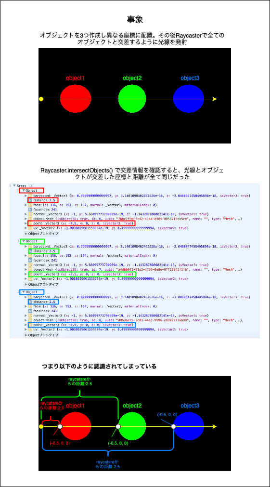
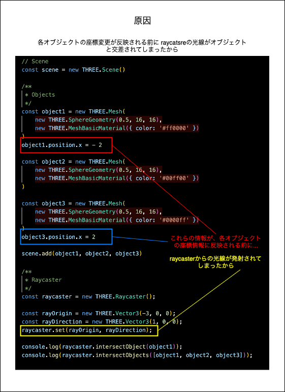
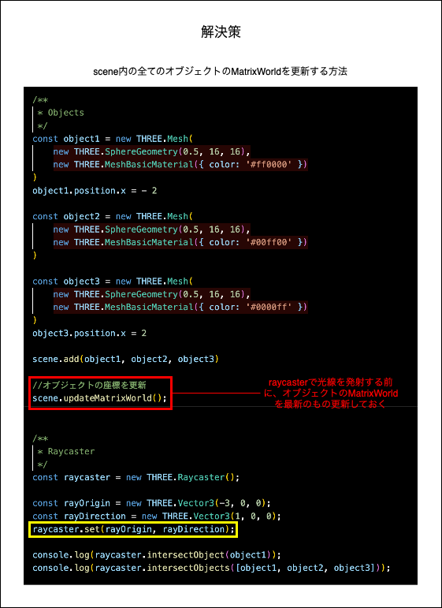
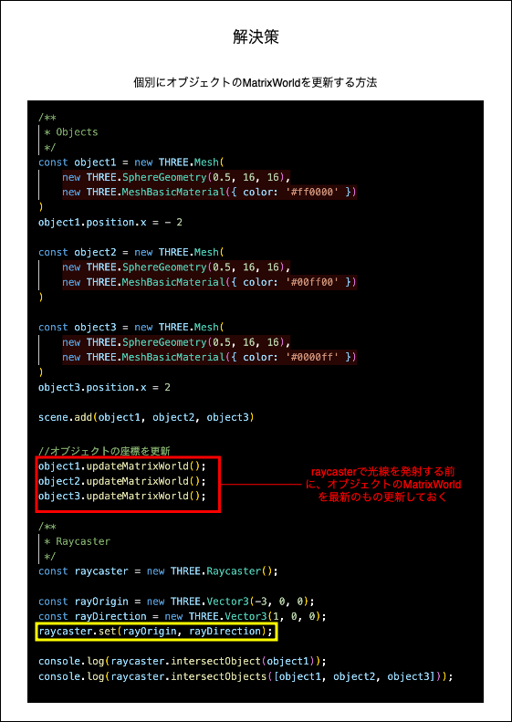
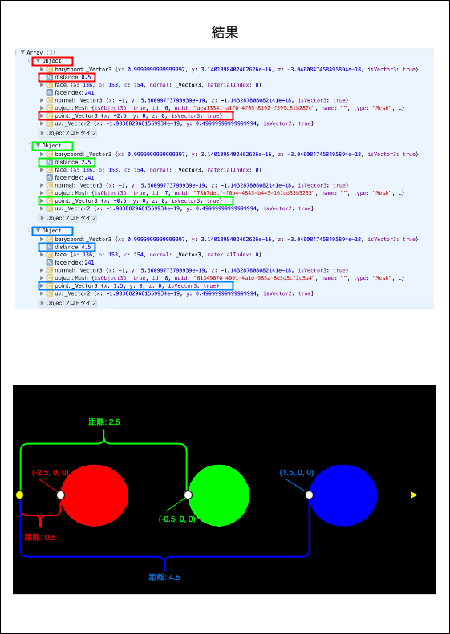

### 事象

- 3つのオブジェクトを作成し、座標を変更し配置した

- Raycaster を作成し、3つのオブジェクトと交差するように光線を照射

- `Raycaster.intersectObjetcs()` で3つのオブジェクトと光線の交差情報を見たところ、光線と交差する座標が全て同じだった

 

---

### 原因

- オブジェクトの座標の変更が適用される前に Raycaster が実行されてしまっているため、Raycaster の原点とそれぞれ位置が違うオブジェクトへの距離が同じに表示されてしまっている

---

### 解決策

- Raycater を実行する前に、強制的にオブジェクトの座標を更新する

- 以下の方法がある

    - `Scene.updateMatrixWorld()` でシーン内の全ての座標を更新する方法

        

     

    - `Object3D.updateMatrixWorld()` で個別のオブジェクト毎に座標を更新する方法

        

 

- 結果、各オブジェクトとRaycaster の原点からの距離や交差点の座標も正しいものが取得されるようになる

    