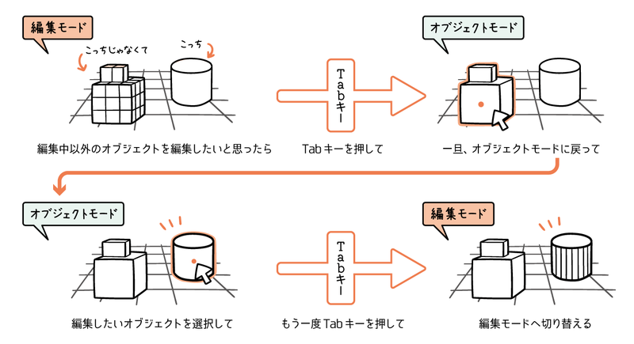

### 視点の移動

引用: [Blenderの基本操作を確認しよう！](https://gihyo.jp/article/2023/02/blender-basics-04)

 

#### 視点の回転

- 方法1

    - マウスホイールを押し込んでマウスを動かす

 

- 方法2

    - トラックパッドの上で２本指で移動 (Mac)

 

#### 視点の並行移動

- 方法1

    - `shift` + マウスホイールを押し込んでマウスを動かす

 

- 方法2

    - `shift` + トラックパッドの上で２本指で移動 (Mac) 

 

#### 視点のズームイン/アウト

- 方法1

    - マウスホイールでズームイン/アウト

 

- 方法2

    - トラックパッド上でピンチイン/アウトでズームイン/アウト

 
 

参考サイト

[Blenderの使い方1（基本的な操作と概要）](https://koro-koro.com/blender-no1/)

[【Blender】編集モード（頂点・辺・面）](https://saru-blender.com/vertex-edge-face)

[Blenderの基本操作を確認しよう！](https://gihyo.jp/article/2023/02/blender-basics-04)

---

### Walk と Fly

- Walk / Flyモードとは 3D Viewport での視点の移動モードのこと

 

- #### Walk モード

    

     

    - ゲームのように歩く感覚で視点を操作するモード

    - Walk モードでの基本的な視点移動は Orbit と Truck

        

        引用: [Three.js Journey ~ Lesson23](https://threejs-journey.com/lessons/custom-models-with-blender)

         

        

        引用: [Three.js Journey ~ Lesson23](https://threejs-journey.com/lessons/custom-models-with-blender)

 

- #### Fly モード

    

    - 空中を自由に飛ぶ感覚で視点を操作するモード

    - Fly モードでの基本的な視点移動は Tilt と Pan

        

        引用: [Three.js Journey ~ Lesson23](https://threejs-journey.com/lessons/custom-models-with-blender)

         

        

        引用: [Three.js Journey ~ Lesson23](https://threejs-journey.com/lessons/custom-models-with-blender)

 

#### Walk / Fly モードの切り替え

- デフォルトは Walk モード

- Walk → Fly になる

    - `shift` + `f`

 

- Fly → Walk に戻る

    - Fly モード中に `クリック` (右でも左でも OK)

---

### Mode

- `ctrl` + `tab` で様々なモードに切り替えることができる

    - 画面右上のセレクトボックスからもモードの切り替えをすることができる

    

     

- 基本的には以下の2つのモードが主に使われる

    - #### Object Mode

        - **オブジェクトの作成/削除**、 複数もしくは個別のオブジェクトの Transform をすることができるモード

        - オブジェクトの Transform は Edit Mode でもできる

        

        引用: [Blenderを使ったモデリングの流れと、モデリングで使う2つのモードを見てみよう！](https://gihyo.jp/article/2023/01/blender-basics-03)

     

    - #### Edit Mode

        - オブジェクトのポリゴンを編集するモード

        - オブジェクトの Transform もできる

        

        引用: [Blenderを使ったモデリングの流れと、モデリングで使う2つのモードを見てみよう！](https://gihyo.jp/article/2023/01/blender-basics-03)

 

- ★★★`Tab` で現在のモードと一個前のモードを切り替え (toggle) することができる★★★

    

    引用: [Blenderを使ったモデリングの流れと、モデリングで使う2つのモードを見てみよう！](https://gihyo.jp/article/2023/01/blender-basics-03)

 

- #### Object Mode ~ オブジェクトの作成

    - `shift (⇧)` + `a` もしくは、画面右上のセレクトボックスからオブジェクトの追加を行うことができる

    

 

- #### Object Mode ~ オブジェクトの削除

    - 削除したいオブジェクトを選択し、 `x` もしくは　`左クリック` でオブジェクトの削除を行うことができる

    

 
 

参考サイト

[Blenderを使ったモデリングの流れと、モデリングで使う2つのモードを見てみよう！](https://gihyo.jp/article/2023/01/blender-basics-03)

---

### オブジェクト (メッシュ) の Transformation

- Transform 操作の前に、Object Mode で操作対象をクリックで選択しておくこと

 

- #### Translate

    - `g` を押した後にマウス移動で任意のポイントに移動できる

        
    
     

    - `g` + `x` で **x 軸上**に沿ってオブジェクトを移動することができる

        
    
     

    - `g` + `y` で **y 軸上**に沿ってオブジェクトを移動することができる

        
    
     

    - `g` + `z` で **z 軸上**に沿ってオブジェクトを移動することができる

        
    
     

 

- #### Rotation

    - `r` を押した後にマウス移動で好きなようにオブジェクトを回転させることができる

        

     

    - `r` + `x` で **x 軸上**に沿ってオブジェクトを回転させることができる

        

     

    - `r` + `y` で **y 軸上**に沿ってオブジェクトを回転させることができる

        

     

    - `r` + `z` で **z 軸上**に沿ってオブジェクトを回転させることができる

        

     

 

- #### Scale

    - `s` を押した後にマウス移動で好きなようにオブジェクトを 大きく/小さく スケールできる

        

     

    - `s` + `x` で **x 軸方向**にオブジェクトをスケールする

        

     

    - `s` + `y` で **y 軸方向**にオブジェクトをスケールする

        

     

    - `s` + `z` で **z 軸方向**にオブジェクトをスケールする

        

---

### メッシュの変形

- Object Mode で変形するオブジェクト (メッシュ) を選択し、 Edit Mode に切り替えること

 

- #### セグメントなどの編集

    - 追加するメッシュによってできるものとできないものがある

    - ★★メッシュの追加後、エリア左下に表示される `Add ~~` をクリックしてセグメントの編集が可能

    - ★★★メッシュの追加直後にしかできない

    

 

- #### position, rotation, scale などの Transformation 系の編集

    - [Object Mode でのメッシュの Transformation](#オブジェクト-メッシュ-の-transformation) と同じ操作方法

 

- #### 頂点, 辺, 面の編集

    - 3D Viewport の左上にあるアイコンからどれ (頂点/辺/面) を基準に編集するかを切り替えることができる

        

     

    - #### 頂点の編集

        

     

    - #### 辺の編集

        

     

    - #### 面の編集

        

---

### Viewport Shading

- Viewport Shading とは 3D Viewport 画面での Shading (陰影処理)
 をどのようなものにするかを変更できる機能のこと

    - 3D Viewport とは 3D シーンを表示するためのエリアのこと (灰色の背景で Grid 線や x, y, z 軸が表示されている画面のこと)

        

 

- Viewport Shading には以下の種類がある

    - Solid: Workbench のレンダリングエンジンを使用して 3D Viewport が表示される (= オブジェクトが均一的な色で塗りつぶされて表示されるイメージ)

        - ★★オブジェクトのマテリアル (色、質感、テクスチャーなど) は反映されない

        - ★★ライティングも反映されない★★

        

     

    - Material Preview: オブジェクトに適用されているマテリアルのプレビューを表示する

        - ★★ライティングは反映されない★★
        
        

     

    - Wireframe: オブジェクトのワイヤーフレームだけを表示する

        - Soild と同様にマテリアルやライティングなどは表示されない

        

     

    - Rendered: 完全なレンダリングを行う。オブジェクトのライティングやシャドウ、マテリアルを考慮した見た目を表示する

        

 

- Viewport Shading の切り替え方法

    - `z` を押して切り替えたいモードの方向にマウスを移動させる

    - 画面左上にある、小さい球体 (=Viewport Shading) を切り替える

    

 
 

参考サイト

[Blenderの使い方1（基本的な操作と概要）](https://koro-koro.com/blender-no1/)

[Viewport Shading](https://docs.blender.org/manual/ja/3.0/editors/3dview/display/shading.html)

---

### Material

- Three.js の Material と同じく、オブジェクトの表面の性質に関する設定

- プロパティビューにある赤い球体のアイコン (マテリアル) を選択することでオブジェクトのマテリアルを設定することができる

    

---

### Render Engine

- #### EEVE

    - パフォーマンス、リアルさのバランスが良いレンダリングエンジン

    - 基本的には EEVE で問題ないので、 Blender ではデフォルトのレンダリングエンジンになっている

 

- #### Workbench

    - レガシーなレンダリングエンジン

    - パフォーマンスは良いが、リアルじゃないし、レガシーなので基本的には使わない

 

- #### Cycle

    - 光の反射などをよりリアルにシミュレートするレンダリングエンジン

        - レイトレーシング

     

    - 高度な処理を行ってくれるため、重い = レンダリングにかかる時間が長い

    
    
 

#### Renderer の変更方法

- プロパティビューにあるカメラのアイコン (= Render アイコン) を選択し、レンダリングエンジンの項目から利用したいものを選ぶ

    

 
 

参考サイト

[Blenderの使い方1（基本的な操作と概要）](https://koro-koro.com/blender-no1/)

---

### ズーム

- マウスホイールやトラックパッドでのピンチイン/アウトでズームする場合、ズームできる距離に限界がある

    

 

- `ctrl` + `shift` + `マウスホイールを押し込んでマウスを移動` でもっとズームイン/アウトすることができる

    

---

### 2次元の Transformation

- Transform操作中に `shift` + `z` を押すことで x, y 上のみの Transform が可能になる

- ★下の gif は 「 x 軸上での translate 」 → 「 y 軸上での translate 」 → 「 z 軸上での translate 」 → 「 x,y 軸上での translate 」 の順で動かしている

    

 

#### ポイント

- Transform 中に `shift` + `操作対象としない軸`