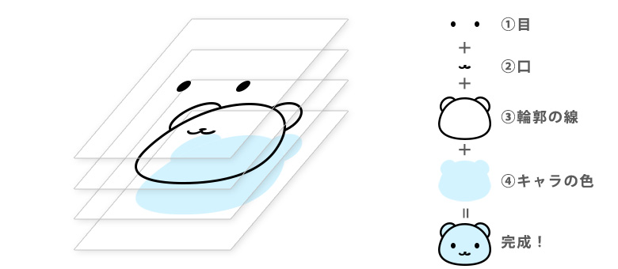

### CubeCamera とは

- Three.js が提供しているカメラの1種

    - CubeCamera と CubeRenderTarget でキューブ環境マップを生成することができる

        

 
 

#### Use Case

- 金属のような背景を反射するマテリアルやガラス玉のような透明で背景を屈折するマテリアルをシミュレーする場合で、**周りにある他のオブジェクトも環境マップ (反射/屈折) に取り込みたいようなケース**で使用される

    - CubeCamera を使わないと → 反射するスフィア型オブジェクトに、その周りを動くキューブ型のオブジェクトが映らない

        

     

    - CubeCamera を使うと → 反射するスフィア型オブジェクトに、その周りを動くキューブ型のオブジェクトが映るようになる

        - 仕組み: 毎フレームごとに、シーン内に配置した CubeCamera が撮影&作成するキューブ環境テクスチャをスフィア型オブジェクトの環境マップに適用している

        

 
 

#### CubeCamera の使い方

- ポイント

    - CubeCamera が撮影したものを元にキューブ環境テクスチャの生成&保存をするために、WebGLCubeRenderTarget インスタンスも作成する必要がある

    - 毎フレームごとに、CubeCamera.update() で撮影を行う

 

1. Scene の背景に使用する環境テクスチャのロード

    - ★背景マップのみに適用するためのもので、ここでは反射/屈折の環境マップには適用しない

    

 

2. `WebGLCubeRenderTarget` と `CubeCamera` のインスタンス化 & Scene の環境マップに `WebGLCubeRenderTarget.texture` を適用する

    - `WebGLRenderTarget`

        - 第1引数: キューブ環境テクスチャ1枚の解像度 (Number)

            
        
         

        - 第2引数: 生成するキューブ環境テクスチャに関するオプション (Object)

            - type プロパティ

                - ★レンダリングされるテクスチャの1ピクセルあたりの「表現できる精度と情報量」を指定する項目

                - よく指定する値は以下の3つ

                    1. THREE.UnsignedByteType  (デフォルト)

                        - 1ピクセル 8bit の情報量をもつ

                        - パフォーマンスは良いが、生成するテクスチャは明るさの情報を持たない

                     

                    2. THREE.HalfFloatType 

                        - 1ピクセル 16bit の情報量をもつ

                        - パフォーマンスとクオリティのバランスがいい

                        - イメージ的には HDR 対応のテクスチャを生成するための値と理解すれば OK

                     

                    3. THREE.FloatType

                        - 1ピクセル 32bit の情報量をもつ

                        - パフォーマンスは悪いが、高クオリティなテクスチャを生成する

                        - イメージ的には EXR 対応のテクスチャを生成するための値と理解すれば OK

     

    - `CubeCamera`

        - 第1引数
            - CubeCamera の near

         

        - 第2引数
            - CubeCamera の far
        
         

        - 第3引数
            - CubeCamera のテクスチャ保存先 (`WebGLCameraRenderTarget` インスタンス)

     

    - `WebGLCubeRenderTarget.texture`

        - CubeCamera によって撮影&生成されるキューブ環境テクスチャ

    

 

3. 毎フレームごとに `CubeCamera.update()` でキューブカメラでの撮影&環境テクスチャの生成を行う

    

 

#### 問題点

- CubeCamera の位置 & キューブ環境マップを適用するオブジェクトの位置 の組み合わせによってはうまく反射/屈折がシミュレートできないことがある

    

     

    

 

- 解決策は以下の2つ

    1. [キューブカメラを反射するオブジェクトの位置に移動する](#キューブカメラを反射するオブジェクトの位置に移動する)

    2. [レイヤー](#レイヤー) を利用して解決する

---

### キューブカメラを反射するオブジェクトの位置に移動する

- 反射するオブジェクトが複数ある場合は?

    → そのオブジェクト分 CubeCamera と WebGLCubeRenderTarget を用意する必要がある

  

#### サンプル

- 以下のようなシーンを作るのが目標

    

 

- 何も考えずに 1つの CubeCamera をシーンの中心に配置し、それぞれのオブジェクトの環境マップに適用した場合

    - 反射するオブジェクトのはずなのに、自身の姿も映ってしまっている

        

     

    - 原因は、中心に配置した CubeCamera からの視点で撮影&テクスチャの生成を行っているから

        

 

- 以下のイメージのように、各オブジェクトからの視点で撮影&テクスチャを生成する必要がある

    

 

#### 手順

1. 各反射/屈折するオブジェクト用の CubeCamera と WebGLCubeRenderTarget を用意する

    

 

2. 各オブジェクトの位置に CubeCamera を移動 & 各オブジェクトの環境マップに、各 WebGLCubeRender で生成された環境マップを適用する

    

 

3. 毎フレームごとに、`CubeCamera.update()` で撮影を行う

    

    
 

- 結果、自身を映さず周囲を反射するオブジェクトができる

    

---

### レイヤー

#### 概要

- Three.js はイラストツールのように、レイヤー機能を提供している

    

    引用: [イラストツールのレイヤーとは？機能と活用方法を徹底解説](https://www.mouse-jp.co.jp/mouselabo/entry/2023/12/20/100023)

     

    - ★Three.js では **Object3D オブジェクト**に0から31までの32個のレイヤーを割り当てることができる

    - ★Three.js では Object3D オブジェクトは**デフォルトでレイヤー0に割り当てられている**

 

- ★★Camera はその[カメラが所属するレイヤーのみを写す](#レイヤーと-camera)

 

#### レイヤーの利用方法

- ポイント

    1. `Object3D.layers.enable(Number)`

        - 対象の Object3D を引数で指定したレイヤーに所属させる

            

     
    

    2. `Object3D.layers.disable(Number)`

        - 対象の Object3D を引数で指定したレイヤーから解約させる

            

     

    3. `Object3D.layers.set(Number)`

        - 対象の Object3D の所属レイヤーを引数で指定したレイヤーのみにする

            

 

#### 以下のようなシーンをレイヤーを利用して作ってみる

 

1. CubeCamera に写したいオブジェクトを Layer1 に追加する

    

     

    - ★★★Group オブジェクト全体を Layer に追加するには、**Group オブジェクトに所属している個々のオブジェクトごとに layers.enable()** で Layer に追加してあげる必要がある

        

 

2. CubeCamer を Layer1 のみに所属させる

    - 毎フレームごとに CubeCamera.update() を実行するを忘れずに

   

 

3. 意図した結果になっていることを確認

    

 

#### 注意点

- 反射オブジェクトと CubeCamera の位置が遠いと、反射の見え方が不自然になる = CubeCamera からの視点でキューブ環境テクスチャを撮影&生成するため

    - 基本的には [キューブカメラを反射するオブジェクトの位置に移動する](#キューブカメラを反射するオブジェクトの位置に移動する) 方法がベター

 
 

参考サイト
[【Three.js】一部のオブジェクトのみにPost Processingをかける](https://zenn.dev/dami/articles/5d9792736a4ffc)

---

### WebGLCubeRenderTarget の type プロパティ

#### - THREE.UnsignedByteType

 

#### - THREE.HalfFloatType

 

#### - THREE.FloatType

 

#### ちなみに...

- MeshBasicMaterial.color に Color(1, 1, 1) を設定しても、 Color(100, 100, 100) を設定しても同じ白になる → 環境マップ (type≠THREE.UnsignedByteType) 上のみ明るく映る

    

    - 詳しくは[こちら](./Materialとcolor.md)を参照

 
 

参考サイト

[HDRIとは ?](https://knowledge.shade3d.jp/knowledgebase/hdriとは)

---

### レイヤーと Camera

- Camera は自身が所属するレイヤーのみを写す

 

- 以下の2つのオブジェクトのみのシンプルなシーンがあるとする

    - 2つのオブジェクトはデフォルトの Layer0 のみに所属している

    - Camera もデフォルトの Layer0 のみに所属している

    

 

#### 実験

1. `Camera.layer.set(1)` を行うと

    - Camera は何も写さなくなる = Camera は Layer1 のみに所属し、緑のオブジェクトと赤のオブジェクトは Layer1 に所属していないから
    
    

 

2. 以下のコードを実行し、「緑のオブジェクトは Layer2 のみに所属」、「赤のオブジェクトは Layer3 のみに所属」、「Camera は Layer2, Layer3 にも所属」 の状況を作る

    

     

    - 結果: カメラは緑と赤のオブジェクト両方を写すようになる = Camera は自身が所属しているすべての Layer を写すから

    
