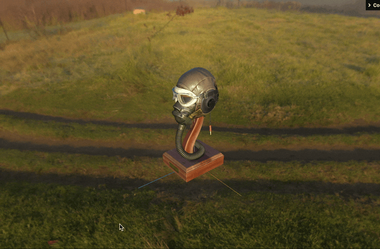
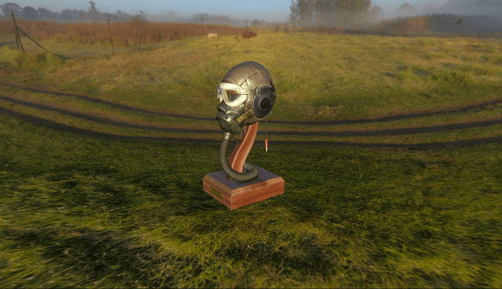
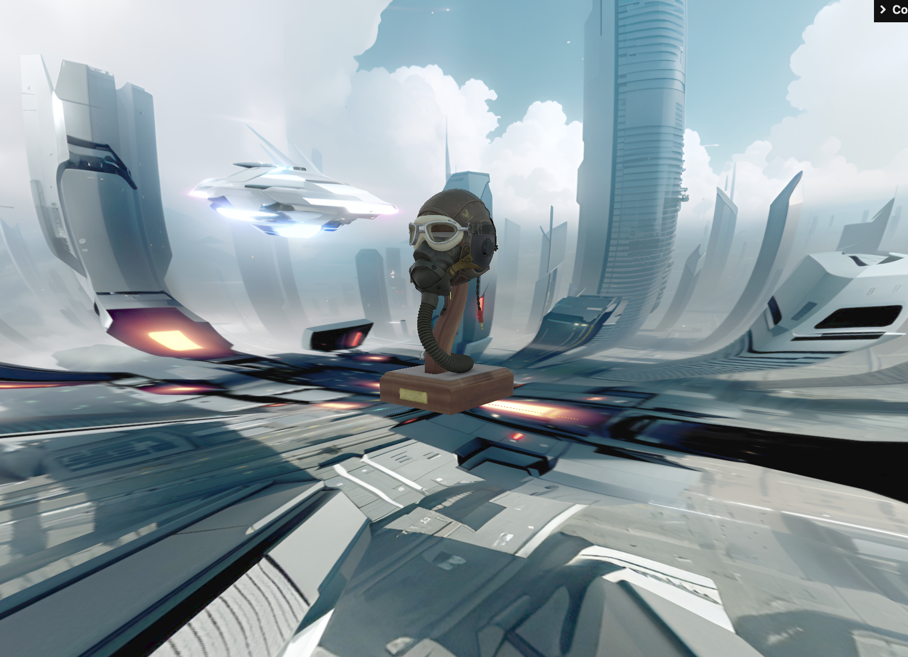

### GroundedSkybox とは

- Three.js の アドオン

- イメージ的には、半球の Mesh を作り出し、その半球の内側に環境マップを適用することで、背景っぽく見せる

    - よって、シーンの背景に環境マップを適用することとは根本的に仕組みが異なる

        

 

### 背景に環境マップを適用するケースとの違い

 

#### Scene.background に環境マップを指定すると

- 普通に環境マップをシーンの背景に設定すると、オブジェクトは空中に浮いているように見える

    

 

- ★背景は無限に遠くにあるので、オブジェクトをどんなに下に移動しても地面 (下限) に到達しない (上、奥、手前も同様)

    - 以下はヘルメットモデルを y 方向に -100 移動したサンプル

    

 

#### GroundedSkyboxを利用すると

- うまく GroundedSkybox を設定すると、オブジェクトが地面に乗っているように見せることができる

    

 
 

参考サイト

[[UIデザイナーが学ぶ]Three.jsの 環境マッピングを使う話](https://note.com/satofaction/n/n84870925476e)

[three.js 入門 (10) - 環境マッピング](https://note.com/npaka/n/na31e6e0ee72f)

---

### GroundedSkybox の使い方

#### 手順
1. GroundedSkybox はアドオン (追加機能) として提供されているため、別途 import する必要がある

    - `three/examples/jsm/objects/GroundedSkybox.js` か `three/addons/objects/GroundedSkybox.js` から import する

        - `addons` は `examples/jsm` のエイリアス

    

 

2. シーンの背景に環境マップを適用する**代わりに** GroundedSkybox 作成し、シーンに追加する

    

     

    - GroundedSkybox

        - 第1引数: 環境マップテクスチャ

        - 第2引数: 高さ

            - GroundedSkyboxメッシュの中心から下底までの距離

        - 第3引数: 半径

            - GroundedSkybox メッシュの半径

        - 第4引数: 解像度 (デフォルトで128)

            - 実態は GroundedSkybox の正体である SphereGeometry の widthSegment と heightSegment に設定する値

            - `GroundedSkybox.material.wireframe = true` で確認できる
            
         

    

    

 

3. オブジェクトの位置と GroundedSkyBox のパラメータを調整する

    

     

4. 結果を確認する

    

---

### 注意点

- GroundedSkybox の半径よりもカメラを遠くに移動させると、正体 (SphereGeometry) がバレる

    

 

- GroundedSkybox の高さよりもカメラを下に移動すると地面が消えたように見える

    

 

- 半球メッシュに背景を写すので、背景によっては不自然に伸びて見えることがある

    - GroundedSkybox の中心となる箇所に何かが写っている場合によく生じる問題

    