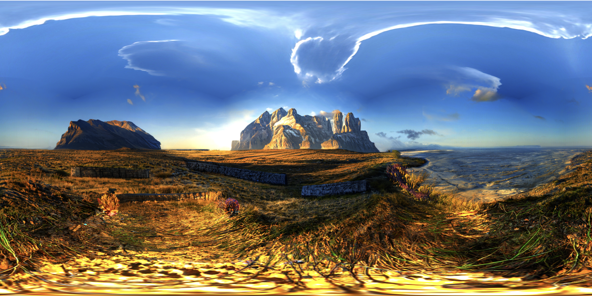

### exr ファイルとは

- HDR 画像の1種

- jpeg などよりも広い色調で表現することが可能な画像フォーマット

- 色調とは別に明るさ情報として輝度値を持つ (もちろんその他の情報も持つ)

 

#### hdr と exr の違い

- [広義の意味での HDR](#広義の意味での-hdr) と exr の違い

    - exr は HDR 画像の具体的な保存形式の1種

 

- [狭義の意味での hdr](#狭義の意味での-hdr) と exr の違い

    - exr の方が hdr (Radiance RGBE 形式) より表現できる色調は広い

    - exr は可逆圧縮に対応している

    - exr は複数のレイヤー、チャンネル、アルファチャンネル、メタデータの保存が可能 = hdr (Radiance RGBE 形式) より高機能と理解すれば良い

    - exr の方が hdr (Radiance RGBE 形式) よりもサイズがデカくなる傾向にある

---

### Three.js で exr ファイルを扱う

- ★exr 用のローダーである `EXRLoader` を使う必要がある

    - `three/addons/loaders/RGBELoader.js` からインポートする必要がある

 

- 使い方は TextureLoader と同じ

#### 手順

- 以下の exr 画像を環境マップに利用してみる

    

 

1. EXRLoader をインポートする

    

 

2. EXRLoader をインスタンス化し、EXRLoader.load() でテクスチャーを読み込み環境マップとして利用する

    

 

3. 結果を確認

    

---

### 広義・狭義の意味での HDR

#### 広義の意味での HDR

- HDR 画像

    - 今までの画像よりもリッチな色調で表現することのできる画像のこと (もしくはその技術のこと)

    - HDR 画像にはさまざまな拡張子 (フォーマット) がある

        - .hdr

            - Radiance RGBE 形式で保存される画像

            - 各ピクセルは R, G, B, E（Exponent） の4バイトの情報を持つ

            - E は指数を意味し、そのピクセルの R, G, B の値をスケールする役割がある

                

         

        - .tif

            - TIFF 形式で保存される画像

            - TIFF という技術は、複数の画像（ページ）を1ファイルに格納可能だったり、多様なカラーモデル（RGB, CMYK, グレースケール など）をサポートするなどの特徴がある

         
        
        - .exr

            - OpenEXR 形式で保存される画像

            - 各ピクセルにRGBだけではなく、アルファや Z深度などの情報 (チャンネル) を持たせることができる

            - .hdr のように R,G,B は1バイト (8bit) で E によって**スケーリングするのではなく**、 RBGそれぞれが 16bit or 32bit で情報を持つ

                - アルファや Z 深度を持たせる場合、それらも 16bit or 32bit

            - ファイルサイズが大きくなる傾向にある

 
 

#### 狭義の意味での HDR

- HDR 画像の拡張子の1つ = .hdr

