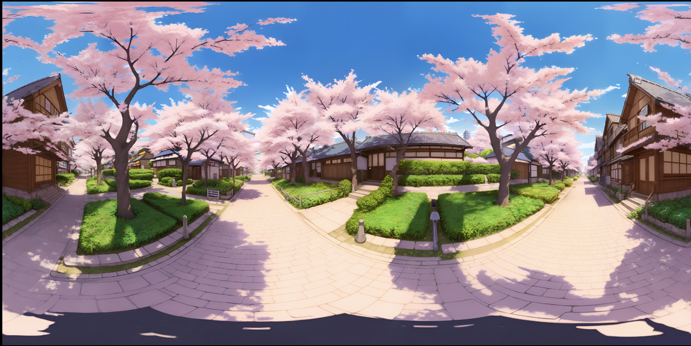

### jpeg の環境マップ

- 画像形式が jpeg でも equirectangular なパノラマ画像であれば、環境マップとして利用することができる

    - hdr, exr は輝度値や広い色調を持つので、背景として利用するのに便利な画像フォーマットにすぎない

---

### jpeg 画像を環境マップとして利用する

- 以下の jpeg 画像を環境マップとして使ってみる

    

 

- TextureLoader で環境マップに利用したい jpeg 画像をロードし、Scene の背景や環境マップに適用する

    

 

- 結果を確認すると

    