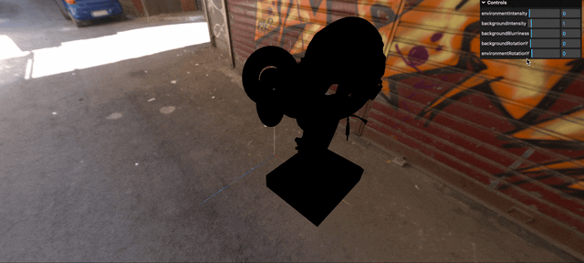
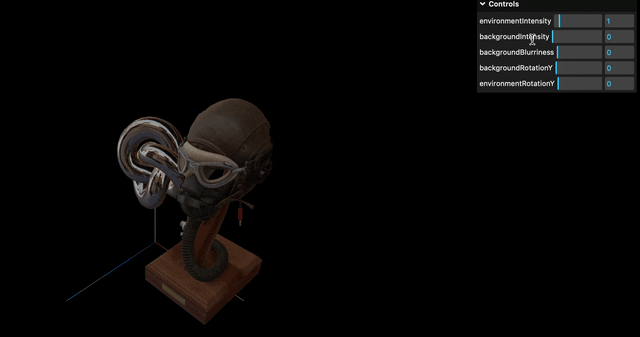
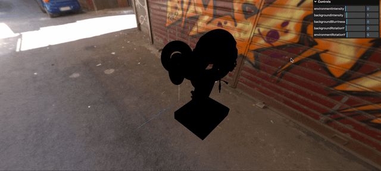
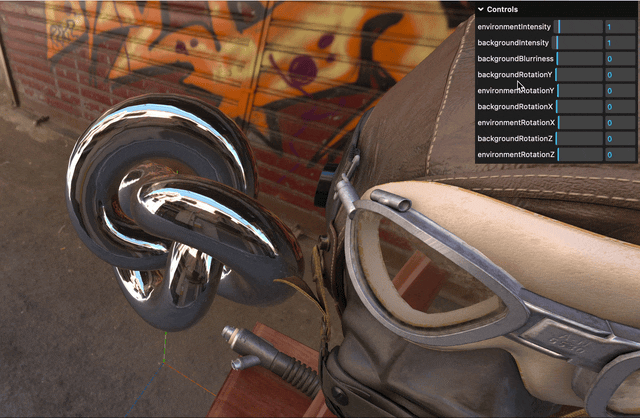
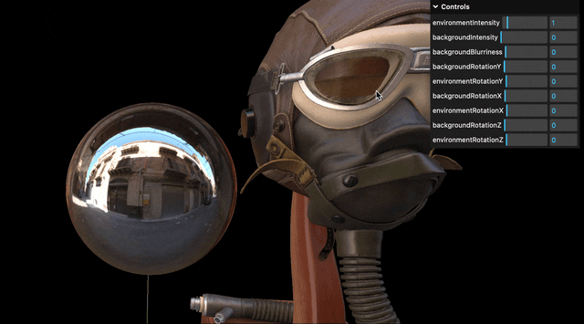
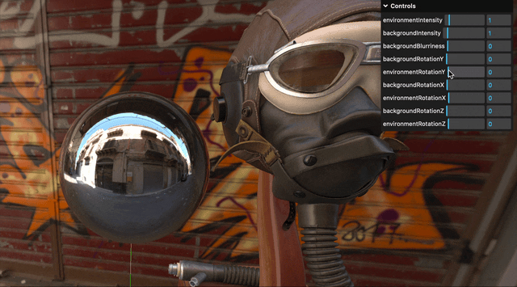

### 環境マップ (背景) の明るさを変更

- `Scene.backgroundIntensity` の値を変更する

- デフォルトは `Scene.backgroundIntensity = 1`

    ```JavaScript
    import * as THREE from 'three'
    import { RGBELoader } from "three/addons/loaders/RGBELoader.js";

    // シーンの作成
    const scene = new THREE.Scene();

    // 環境マップのロード
    const hdrLoader = new RGBELoader();
    hdrLoader.load(
        "環境マップ画像(hrd)のパス",
        (envMap) => {
            envMap.mapping = THREE.EquirectangularRefractionMapping;
            // 環境マップ(背景)の適用
            scene.background = envMap;
        }
    );

    // ★(背景)環境マップの強さ (=明るさ) を変更
    scene.backgroundIntensity = 4;
    ```

    <br>

    

---

### 環境マップ (反射や屈折) の明るさを変更

- `Scene.environmentIntensity` の値を変更する

- デフォルトは `Scene.environmentIntensity = 1`

    ```JavaScript
    import * as THREE from 'three'
    import { RGBELoader } from "three/addons/loaders/RGBELoader.js";

    // シーンの作成
    const scene = new THREE.Scene();

    // 環境マップのロード
    const hdrLoader = new RGBELoader();
    hdrLoader.load(
        "環境マップ画像(hrd)のパス",
        (envMap) => {
            envMap.mapping = THREE.EquirectangularRefractionMapping;
            // 環境マップ(反射)の適用
            scene.environment = envMap;
            scene.
        }
    );

    // ★(反射/屈曲)環境マップの強さ (=明るさ) を変更
    scene.environmentIntensity = 4;
    ```

    <br>

    
---

### 背景をぼやかす

- `Scene.backgroundBlurriness` の値を変更する

- デフォルトは `Scene.backgroundBlurriness = 0`

- ★値の範囲は 0 ~ 1 の間

    

<br>

- ★解像度の低い環境マップを利用する際に、`Scene.backgroundBlurriness` で少しぼやかすと誤魔化すことができる

---

### 環境マップ (背景) を回転させる


<br>

- `Scene.backgroundRotation` で背景の環境マップを回転させることができる

    - `Scene.backgroundRotation.set(x, y, z)` で3軸の回転を1回の命令で行うことができる

    - `Scene.backgroundRotation.x (y, z)` でどれか1つの回転軸を指定しての回転も可能

    - 回転角はラジアン

    

    *上記 gif では y → x → z の順番で回転させている

<br>

- ★`Scene.backgroundRotation` の変更だけでは**オブジェクトに映り込んでいる反射/屈折 (Scene.envMap) は回転しないことに注意**

    

---

### 環境マップ (反射や屈折) を回転させる

- Scene.environmentRotation でオブジェクトに映り込んでいる 反射/屈折環境マップを回転させることができる

<br>

- イメージや使い方は [`Scene.backgroundRotation`](#環境マップ-背景-を回転させる) とほぼ同じ

    

<br>

- ★`Scene.backgroundRotation` と同様に、`Scene.environmentRotation` の変更だけでは**背景の環境マップ (Scene.background) は回転しない**

    