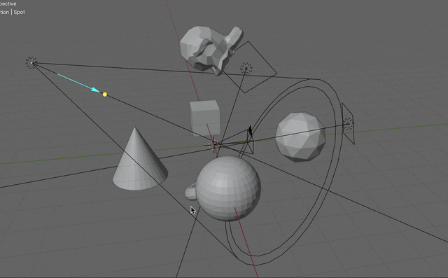
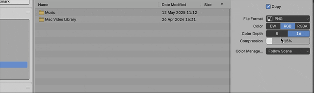
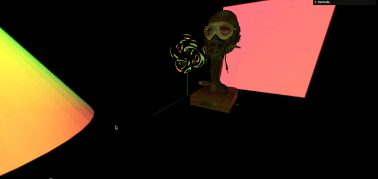

### Blender にて環境マップを作成する方法

 

#### 環境マップ作成手順

1. レンダリングエンジンに Cycles を指定する

    - ★レンダリングエンジンが EEVEE や Worlbench では**カメラの Panorama Type が指定できず Equirectangular なパノラマ環境マップが作成できない**

     

    

 
 

2. 環境マップを作成するカメラのプロパティを以下のように設定する

    - レンズタイプ: Panoramatic

    - Panorama Type: Equirectangular

    → Equirectangular なパノラマカメラからパノラマ環境マップ (Equirectangular) を作成することができる

     

    

 
 

3. 適当にオブジェクトやライトを設置する

    

 
 

4. 画面左上部の `Render` から `Render Image` を選択する

    

     

    - \*この時、レンダリングに時間がかかる場合は `output` プロパティから `Render` の `MaxSampling` の値を低くするとレンダリング時間が短くなる (クオリティは低下する可能性があるので注意)

        

 
 

5. レンダリング内容を確認し、問題ない場合は `Image` から `Save as` で画像として保存する

    

 
 

6. ★画像の形式を HDR (Radiance HDR) に指定してから保存する

    

 
 

7. 最後に、Three.js を使ったコードにて　RGBELoader で環境マップを取り込む

    

 
 

参考サイト

[Blender / レンダリング（カメラ・ライト）](https://koro-koro.com/blender-no4/)

---

### 他のツールで環境マップを作成する方法

#### AI ツール

- NVIDIA Canvas

    - ★2025年現在は [NVIDIA Studio](https://www.nvidia.com/en-us/studio/) という製品の一部になった

---

### Output プロパティのレンダーとビューポート

- output プロパティで設定できるサンプリング数の項目は [`Render`](#render) と [`Viewport`](#viewport) がある

 

#### Render

- 実際にシーンをレンダリングする際に関わってくる項目

 

#### Viewport

- 3D ポートをレンダリングモードで表示する時に関わってくる設定項目
 
 

参考サイト

[【2024】レンダリングとプレビューの違いは？それぞれの機能と確認方法を解説](https://jp.renderpool.net/blog/difference-between-rendering-and-preview)

[【Blender2.9】レンダリングのやり方：これを読めば一安心。](https://cgbox.jp/2020/10/04/blender-rendering/)