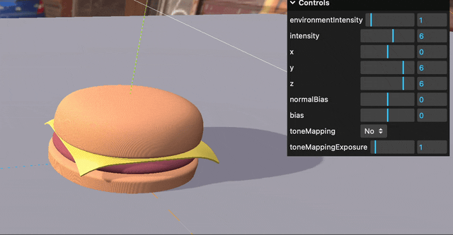
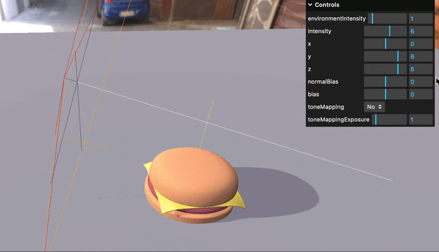

### 環境マップに合わせた影を落とす

- ★オブジェクトに環境マップ (反射/屈折) を適用しても、そのオブジェクトデフォルトでは影を落とさない

---

### 3D モデルに影を落とす

- ★Group に対して castShadow / dropShadow を true / false にしても、その子オブジェクト (Mesh) に自動では反映されない

    - 再帰的に影の設定を行う必要がある

     

    

     
    
    

---

### Shadow Acne

- オブジェクトに変な縞模様の影がかかる事象

    

 
 

#### Shadow Acne の原因

- 黒い線に見える模様の正体は**影**

    

 
 

#### Shadow Acne の解決法

1. シャドウマップのテクセルサイズを小さくする = シャドウマップの解像度を高くする

    - ★シャドウマップの解像度を上げれば上げるほど GPU メモリ使用量増大 + レンダリング負荷も増加する

    - ★★どんなに解像度を高くしても影が当たる箇所 (= Shadow Acne の原因) は発生するので、現実的な有効手段でない

        

     

    - シャドウマップの解像度を変更するには [Light オブジェクトの shadow.mapSize プロパティを変更する](https://github.com/MasaGt/threejs_journey/blob/b5fdc4a8f6f64d94f08f655b77901cdbaae9ae8a/chap2/15/Shadows.md#optimizing-shadows--シャドウマップの解像度の変更)

        

 
 

2. シャドーバイアスを調整する

    - Three.js では提供されている以下のシャドーバイアスの値を調整する

        1. [Lightオブジェクト.shadow.bias](#shadowbias)

        2. [Lightオブジェクト.shadow.normalBias](#shadownormalbias)

     

    - 処理はシャドウマップの解像度の変更に比べてかなり軽い + シャドウマップ解消効果も高い

    - 一方で、調整がうまくいかないとオブジェクトが変に浮いて見えたりするので注意

---

### Shadow.bias

- レンダリング時に、オブジェクトのピクセルとシャドウマップ上での深度比較 (影判定) に影響を与えるパラメータ

    - 深度比較に使われるパラメーターのため、設定する値はとても小さくすることが多い (シャドウマップの深度の範囲は 0.0 ~ 1.0)

 

- ★超ざっくり説明すると、シャドーマップ上の影かどうかの境界を調整するイメージ

    

 

- ★★★Three.js では shadow.bias に**負の値を設定するとそのライトの光に当たっているという判定になりやすくなり、正の値を設定するとそのライトには当たらずに影がかかっているという判定になりやすくなる**

 

#### 理解に苦労した箇所

- ChatGTP の説明からは、shadow.bias に負の値を設定すると影が当たっていると判定されやすくなり、正の値を設定すると光が当たっていると判定されやすくなる様子だった

    

    - ★★しかし、実際に Three.js で Light オブジェクトの shadow.bias をいじってみると逆の動きをした = 正の値を設定するとオブジェクトに影が当たり、負の値を設定するとオブジェクトに光が当たる

    

    - ↑の理由: ★★★実際に Three.js で実装されている内容だと、`shadowMapDepth (シャドウマップ上の深度) + shadow.bias` ではなく、 `shadowMapDepth (シャドウマップ上の深度) - shadow.bias` で計算されているっぽい

    

    引用: [Shadow Mapping In Three.js](https://mofu-dev.com/en/blog/threejs-shadow-map/)
    

 
 

参考サイト

[シャドウマッピングの基本](https://www.project-asura.com/articles/d3d11/d3d11_008.html)

[Shadow Mapping In Three.js](https://mofu-dev.com/en/blog/threejs-shadow-map/)

---

### Shadow.normalBias

 

- シャドウマップ生成時に、その深度計算に影響を与えるパラメータ

    - シャドウマップ生成時のオブジェクトの深度に影響を与えるパラメーターのため、ワールド空間の距離を基本とした値で設定することが多い = [Shadow.bias](#shadowbias) よりも大きい値で設定することが多い

 

- shadow.normalBias に**正の値を設定すると**、実際のオブジェクトの位置よりも設定した値分**法線方向に小さくイメージ**

    - 光が当たっていると判定されやすくなる

    

     

- 逆に shadow.normalBias に**負の値を設定すると**、実際のオブジェクトの位置よりも設定した値分**法線方向に大きくイメージ**

    - 影になっていると判定されやすくなる

    - normalBias の値を小さくしすぎると影がオブジェクトが離れてしまい、オブジェクトが浮いて見える (実際は浮いていないのに) という**ピーターパン現象**が起きる

    

 

#### 理解に苦労した箇所

- なぜ normalBias の値を大きくするとオブジェクトの大きさを法線方向に小さくして計算される & 値を小さくするとオブジェクトの大きさを法線方向に大きくして計算されるのか

    → たぶん、 shadow.bias と同じように 元のオブジェクトの位置 - normalBias みたいな計算で実装されていると予想

    