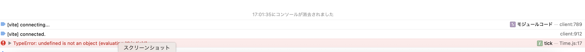
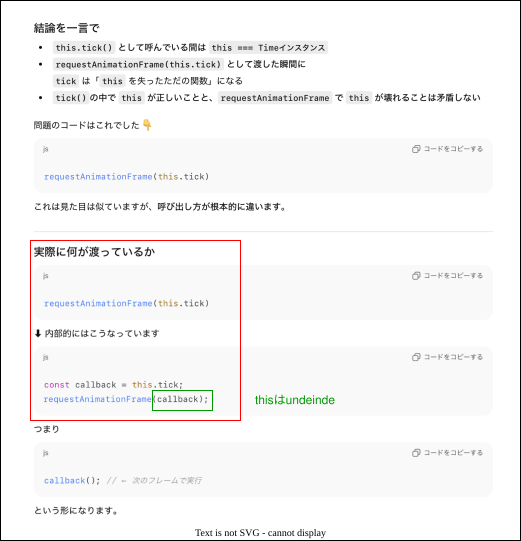
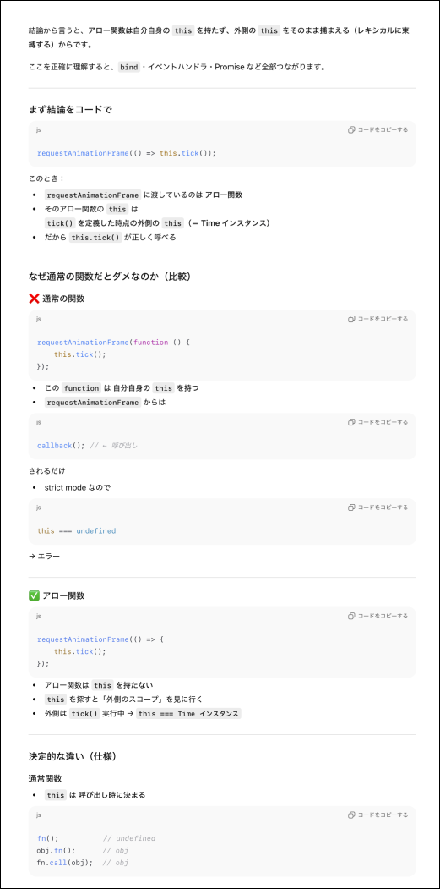

### 事象

以下のクラスにて this の参照結果が undefined になり、アプリがうまく動作しない

- Timer.js

    ```js
    /**
     * 時間を管理するクラス
    */

    import EventEmitter from "./EventEmitter";

    export class Timer extends EventEmitter {
        constructor() {
            super();
            this.start = Date.now();
            this.current = this.start;
            this.elapsed = this.current - this.start; //インスタンス初期化時の時間以降の経過時間

            this.tick();
        }

        tick() {
            //Timer内の時間を更新
            const currentTime = Date.now();
            this.delta = currentTime - this.current;
            this.current = currentTime
            this.elapsed = currentTime - this.start;

            //次のフレーム終了時にもtickを呼ぶ
            requestAnimationFrame(this.tick);
        }
    }
    ```

    <br>

    
    
---

### 原因

- tick() 内での requestAnimationFrame(this.tick) の this が undefined になってしまっている

    → コールバック関数への**引数** this は undefined になってしまう

    

<br>
<br>

参考サイト

[JavaScriptのコールバック関数とthisの関係についてシェア　＃新人エンジニア向け](https://note.com/yukikkoaimanabi/n/n12ef1c95a81d#5f236e6a-1547-4078-93f5-71e780b79a0d)

---

### 解決方法

- tick() 内での `requestAnimationFrame` に渡す関数を以下のように修正する

    ```diff
    import EventEmitter from "./EventEmitter";

    export class Timer extends EventEmitter {
        constructor() {
            super();
            this.start = Date.now();
            this.current = this.start;
            this.elapsed = this.current - this.start; //インスタンス初期化時の時間以降の経過時間

            this.tick();
        }

        tick() {
            //Timer内の時間を更新
            const currentTime = Date.now();
            this.delta = currentTime - this.current;
            this.current = currentTime
            this.elapsed = currentTime - this.start;

            //次のフレーム終了時にもtickを呼ぶ
    -        requestAnimationFrame(this.tick);
    +       requestAnimationFrame(() => this.tick());
        }
    }
    ```

<br>

#### なぜ `requestAnimationFrame(() => this.tick());` で　 thiｓ が保持されるのか?

