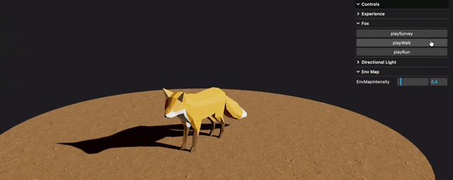
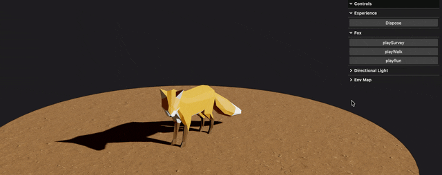
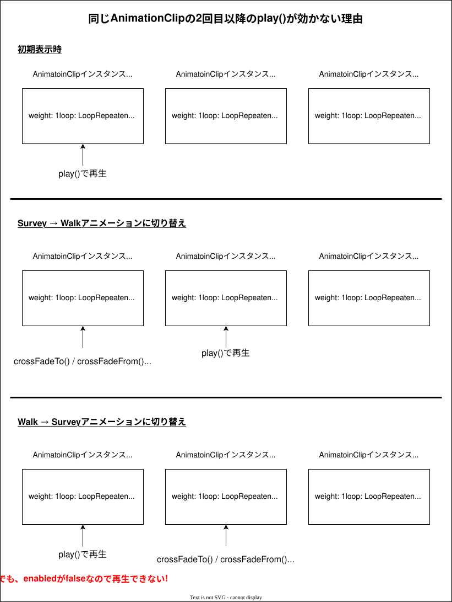
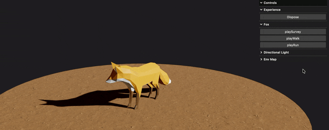
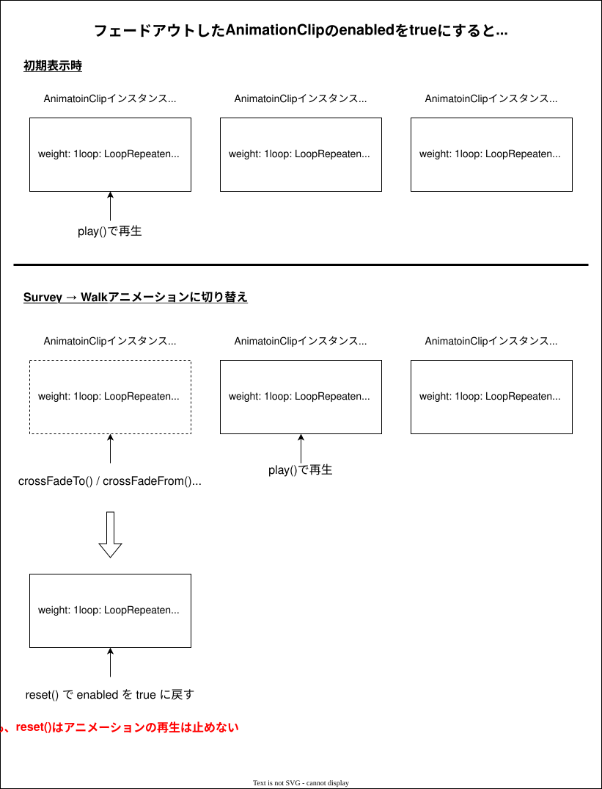
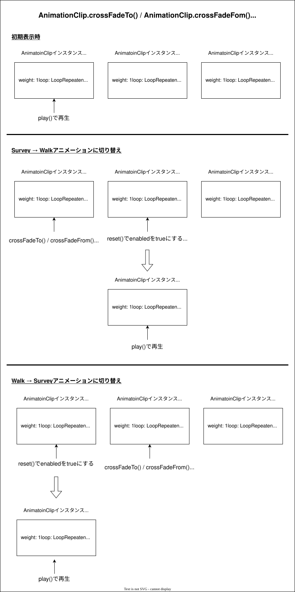

### 事象

- 以下のコードでアニメーションをトランジションありで切り替えたかったが、うまくいかない

    

 

- 事象としては、デフォルトのアニメーション (周りを見渡す Survey アニメーション) だけうまく再生されるが、他のアニメーションに切り替えると動かなくなる

    

---

### 原因

- `AnimationClip.crossFadeTo()` / `AnimationClip.crossFadeFrom()` を実行するだけでは、切り替え対象が再生されるわけではない

    - 切り替え対象のアニメーションを再生 (`AnimationClip.play()`) をする必要がある

 

- ★しかし、以下のようなコードだと、同じアニメーションの2回目以降の切り替えは効かなくなる

    

     

    

     

    - 上の不具合は、`AnimationClip.crossFadeTo()` / `AnimationClip.crossFadeFrom()` は、フェードアウトしたアニメーション (AnimationClip) の enabled というプロパティを false にすることが原因になっている

        

 

- ★では、フェードアウトしたアニメーション (AnimationClip) の enabled というプロパティを true に戻せばいいと思って以下のコードを書いてもうまくいかない

    →切り替え前と後のアニメーションが被さって再生される

    

     

    

     
    
    - 上の不具合の原因として、`AnimationClip.reset()` は `AnimationClip.enabled` を true に戻すが、アニメーション自体の停止はしないので、次のアニメーションに被さって再生される

        

---

### 解決方法

- 以下の2つを解決する必要がある

    1. #### 切り替え先の AnimationClip を play() で再生する必要がある

        - `AnimationClip.crossFadeTo()` / `AnimationClip.crossFadeFrom()` は、切り替え先のアニメーションの AnimationClip インスタンスを返すので、その AnimationClip インスタンスの `play()` を呼べばいい

            

     

    2. #### フェードアウトした AnimationClip の enabled を true に戻す + フェードアウトしたアニメーションの再生を停止する

        - フェードアウトしたアニメーションに対して `AnimationClip.stop()` を実行する 
            
            - ★`AnimationClip.stop()` は内部で `AnimationClip.reset()` を実行し、アニメーションを停止する

         

        - もしくは、フェードインする (=切り替え先) アニメーションの enabled を `AnimcationClip.reset()` で true にする (**こっちの方が一般的らしい**)

            

 
 

- 最終的なコード 

    - `AnimationClip.stop()` でフェードアウトしたアニメーションを停止する ver

        

     

    - `AnimationClip.reset()` でフェードインするアニメーションをリセットする ver

        