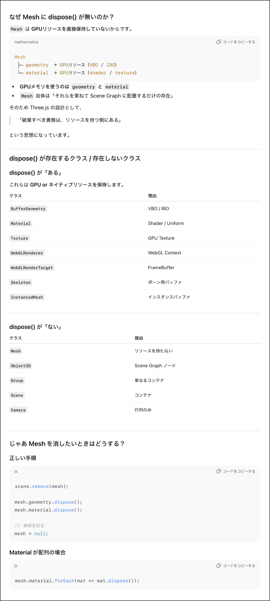
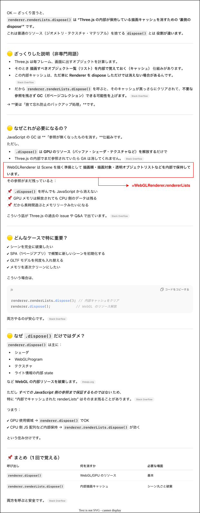

### リソースの破棄

- Three.js オブジェクトは明示的にリソースの破棄をしないと、画面をクローズなどしない限り残り続け GPU などのリソースを無駄に消費してしまうため、**必要なくなったら明示的に破棄する必要がある**

<br>
<br>

参考サイト

[Three.jsパフォーマンス最適化についてのまとめ - リーソースの破棄](https://koro-koro.com/three-js-performance-optimization/#リーソースの破棄)

---

### 具体的なコード例

```js
import * as THREE from "three";

//シーンの作成
const scene = new THREE.Scene();

//オブジェクトやカメラ、レンダラーの作成のコードは省略

//マイフレームごとの更新処理
let rafId;
const tick = () => {
    renderer.render(scene, camera);
    rafId = window.requestAnimationFrame(tick);
}
tick();

//リソースを破棄する関数
const dispose = () => {

    //1. シーン中のジオメトリ、マテリアルの破棄
    scene.traverse((child) => {

        //1-1. シーンのオブジェクトがMeshかどうか判定
        if (child instance of THREE.Mesh) {
            //1-2. メッシュのジオメトリの破棄
            child.gemetry.dispose();

            //1-3. メッシュのマテリアル関連の破棄
            /*
            * ★★forで回している理由: Mesh.Materialには color, transparent プロパティの他に
            * mapやroughnessMap、aoMapなどのテクスチャーを保存するプロパティがあり、
            * テクスチャーを消さずにマテリアルを破棄してしまうとテクスチャーは残り続けてしまう
            */
            for (const prop in child.material) {

                //1-4. マテリアル中のテクスチャーの破棄
                if (child.material[prop] instanceof THREE.Texture) {
                    child.material[prop].dispose();
                }
            }

            //1-5. マテリアルの破棄
            child.material.dispose();
        }
    });

    //2. アニメーションMixerの破棄
    if (mixer) {
        //2-1. アニメーションMixerが管理しているアニメーションを全て停止
        mixer.stopAll();

        //2-2. アニメーションMixerが管理しているアニメーションを全て破棄
        mixer.uncacheRoot(mixer.getRoot());
    }

    //3. requestAnimationFrameの停止
    window.cancelAnimationFrame(rafId);

    //4. カメラの破棄
    scence.remove(camera);

    //5. レンダラーの破棄
    //5-1. レンダラーのキャッシュを破棄
    renderer.renderLists.dispose();
    //5-2. レンダラーから描画対象のHTMLElementの削除
    renderer.domElement.remove();
    //5-3. レンダラーの破棄
    renderer.dispose();
}
```

<br>

#### ポイント

- ##### Mesh は `dipose()` しなくていい

    

<br>

- ##### `renderer.renderLists.dispose()` は WebGLRenderer が内部でキャッシュしている情報を破棄する処理

    
