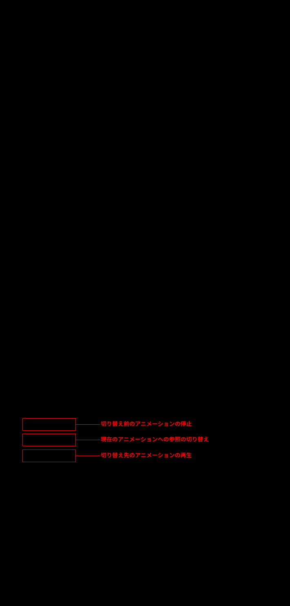
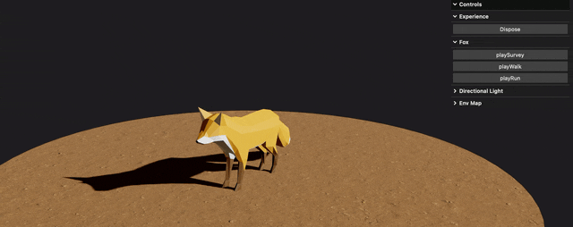

### モデルのアニメーションの切り替え方法

- 基本的な考え方

    - 切り替え前のアニメーション (AnimationClip) を停止する

    - 切り替え先のアニメーション (AnimationClip) を再生する

    

 

- 注意点

    - 切り替え時の見え方としては不自然 (=アニメーションの途中で切り替えると特に顕著だが、アニメーションがブツりと切れるように切り替わってみえる)

        

 
 

参考サイト

[Three.js アニメーション システム（Mixamoアニメーションの統合）](https://koro-koro.com/threejs-animation-system/)

---

### トランジション有りのアニメーションの切り替え

- Three.js が提供している [AnimationAction](https://threejs.org/docs/#AnimationAction) クラス (ビルトインクラス) が提供している `crossFadeTo / crossFadeFrom` を使う

    - 注意するべきポイントは[こちら](#トランジション有りのアニメーションの切り替え)を参照

        
